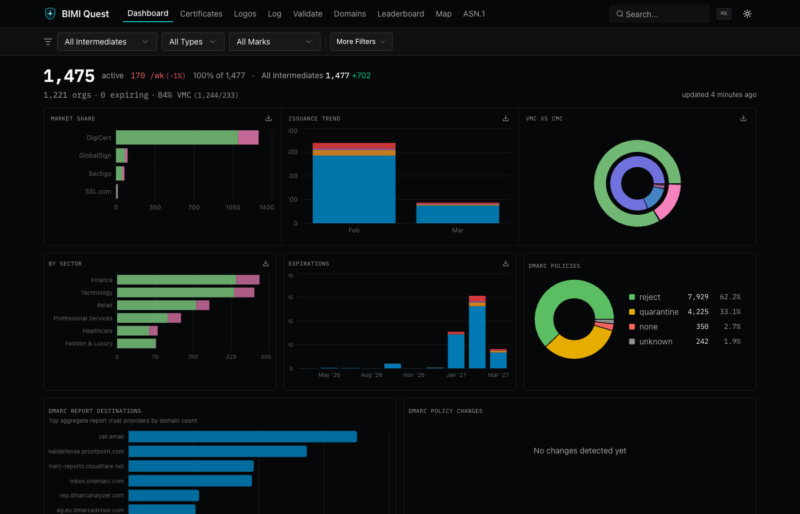
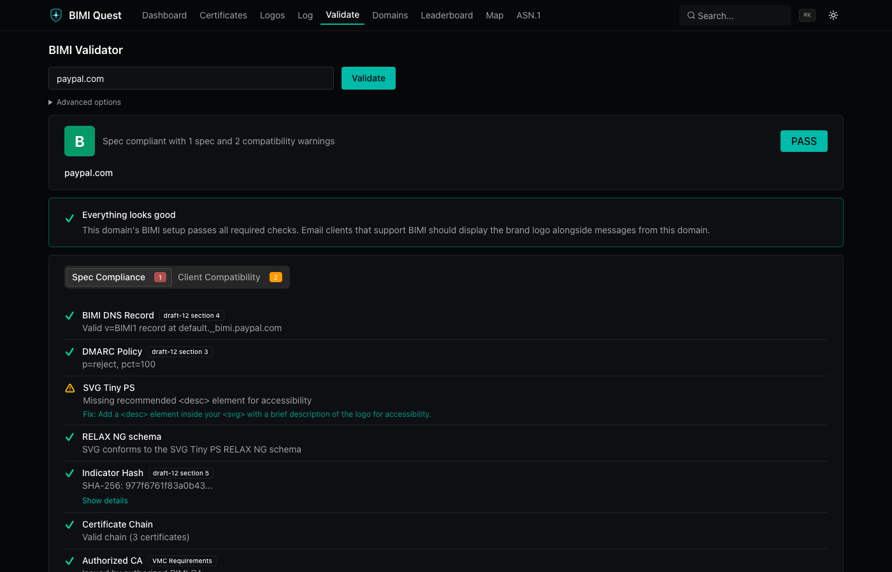
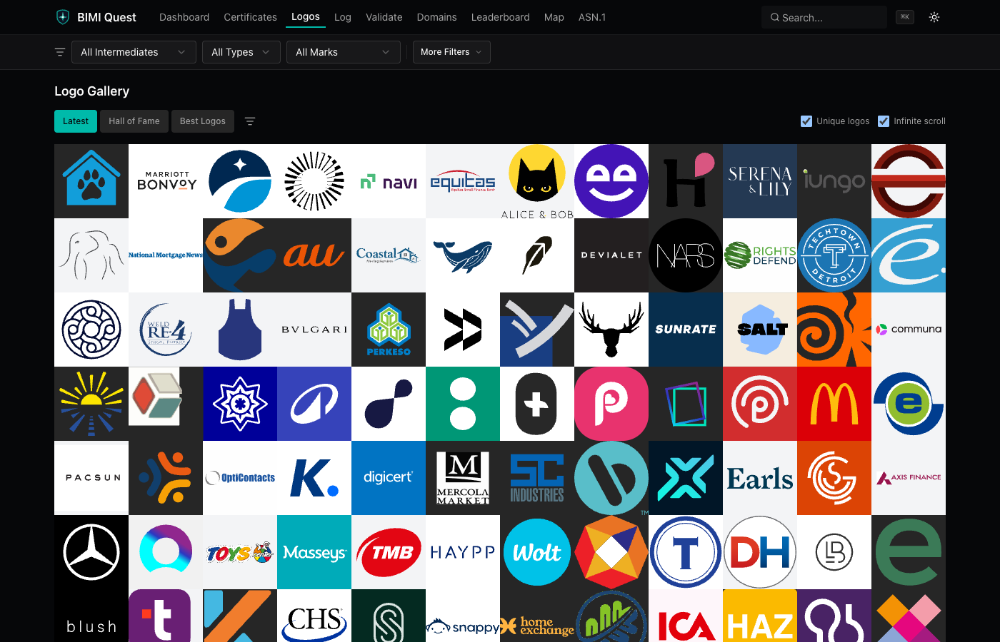
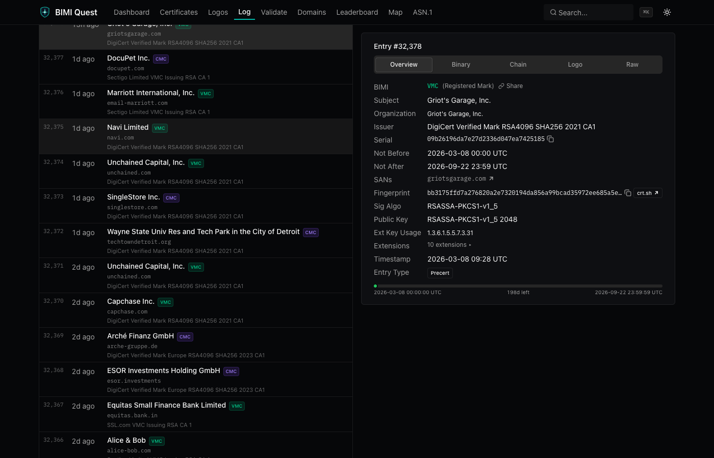

# BIMI Quest

CT observatory for BIMI (VMC/CMC) certificates.

[](https://github.com/swhitt/bimi-quest/actions)
[](LICENSE)
[](https://bimi.quest)

<p align="center">
  
</p>

<table>
  <tr>
    <td></td>
    <td></td>
    <td></td>
  </tr>
  <tr>
    <td align="center"><em>Validator</em></td>
    <td align="center"><em>Logo Gallery</em></td>
    <td align="center"><em>CT Log Viewer</em></td>
  </tr>
</table>

## Who This Is For

| You are... | You use BIMI Quest to... |
|---|---|
| **Email deliverability engineer** | Validate your org's BIMI setup end-to-end before go-live (DNS, DMARC, SVG Tiny PS, cert chain, CAA, receiver trust) |
| **CA product manager** | Track your VMC/CMC market share vs competitors, monitor issuance trends, spot churning customers |
| **Brand protection team** | Monitor which domains hold BIMI certs for your brand, catch unauthorized issuances via CT log feed |
| **CISO / compliance** | Verify DMARC policy enforcement (reject/quarantine + pct=100), check cert expiry timelines across your portfolio |
| **Email security researcher** | Browse raw CT log entries, inspect ASN.1 structures, analyze BIMI adoption patterns by industry/country |
| **MSP / consultant** | Run quick BIMI readiness checks for clients, export certificate data as CSV for reports |

## Features

| Feature | What it does |
|---|---|
| **Dashboard** | KPI cards, market share, issuance trends, cert type breakdown, industry/expiry/DMARC charts, top orgs, recent certs |
| **Certificate Browser** | Filter by CA, type, mark, validity, date range, country, industry. CSV export. Notability scoring |
| **BIMI Validator** | 8-step check: DNS, DMARC, SVG Tiny PS (RNG schema), cert chain, CAA, LPS trace, receiver trust, A-F grade |
| **Logo Gallery** | Presets (Latest, Hall of Fame, Best), smart light/dark bg, perceptual dedup (dHash), quality scoring |
| **CT Log Viewer** | Browse DigiCert Gorgon entries, hex viewer with ASCII, ASN.1 tree, cert chain decode |
| **Domain Detail** | BIMI grade, readiness score (0-100), DNS snapshots, DMARC drift history |
| **Leaderboard** | Organizations ranked by BIMI adoption, filterable by CA/type/country |
| **Geographic Map** | Certificate distribution by country (d3-geo + TopoJSON) |
| **ASN.1 Explorer** | Interactive DER structure viewer for arbitrary certificates |
| **Keyboard UX** | Cmd+K command palette, global CA/date/type filters persisted across navigation |
| **Integrations** | Discord alerts (notability >= 5), RSS feed, PWA, domain watch webhooks |

## Architecture

```
DigiCert Gorgon CT Log
        │
  Ingestion Worker ── @peculiar/x509 parsing
  (backfill/stream)   BIMI OID detection
                      notability scoring
        │
  Neon PostgreSQL ─── certificates, domain_bimi_state,
  (Drizzle ORM)       ca_certificates, dmarc_policy_changes
        │
  Next.js 16 ──────── Dashboard, Validator, Browser,
  (Server Components)  Gallery, Map, CT Viewer, API
```

## Validation Engine

The validator runs an 8-step pipeline against any domain:

1. **BIMI DNS lookup** - selector support, org-domain fallback
2. **DMARC policy validation** - p=reject|quarantine, pct, alignment
3. **SVG Tiny PS validation** - RelaxNG schema via xmllint-wasm
4. **Certificate chain validation** - authorized CA check per CA/B Forum
5. **SVG-cert hash match** - verifies the logo matches what the cert covers
6. **CAA record checking** - confirms issuer authorization
7. **LPS discovery** - Logo Protection Scheme tiered lookup
8. **Receiver trust matrix** - Gmail, Apple, Yahoo support status

Authorized CAs: DigiCert, Entrust, SSL Corporation, GlobalSign, Sectigo.

Each step produces a pass/warn/fail result. The domain gets an aggregate A-F grade and a 0-100 readiness score.

## Setup

**Prerequisites:** [Bun](https://bun.sh), a [Neon](https://neon.tech) database

```sh
cp .env.example .env    # fill in DATABASE_URL
bun install
bun run db:push
bun run dev
```

### Worker Modes

| Command | What it does |
|---|---|
| `bun run ingest:backfill` | Scan Gorgon CT log from last saved cursor |
| `bun run ingest:stream` | Long-running poller, checks for new entries every 30s |
| `bun run ingest:reparse` | Re-parse all stored certificates (after parser changes) |
| `bun run ingest:rescore` | Recalculate notability scores |
| `bun run ingest:check` | Validate DB integrity, report anomalies |

## Development

```sh
bun run dev          # Next.js dev server
bun run build        # Production build
bun run db:push      # Push schema to Neon
bun run db:generate  # Generate Drizzle migrations
bun run db:studio    # Open Drizzle Studio
```

## Stack

- **Runtime:** Next.js 16, React 19, TypeScript, Bun
- **Database:** Neon PostgreSQL, Drizzle ORM
- **PKI:** @peculiar/x509, xmllint-wasm
- **UI:** shadcn/ui, TanStack Table, Recharts, Tailwind CSS 4
- **Geo:** d3-geo, TopoJSON
- **Quality:** Vitest, Playwright, Biome, Lefthook

## License

[MIT](LICENSE)
